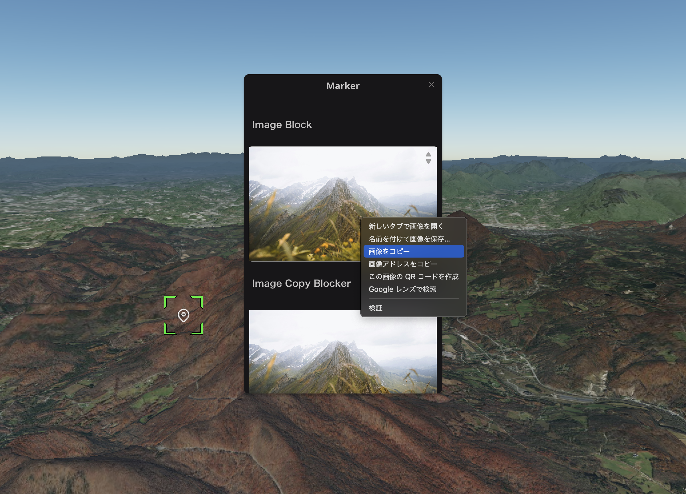

# 画像コピー禁止 プラグイン

## このプラグインについて

-  インフォボックスに表示する写真をブラウザの「画像保存」でコピーできなくします。

### 設定

- 写真を表示するレイヤーを選択し、インフォボックス作成ボタンを押します。インフォボックス内の'+’を押すと、プラグインリストが表示されますので、「banned copy」を選択します。

  

- 右パネルの設定

  表示する写真の設定を行います。

  

  - 画像
  
    インフォボックスに表示する画像を指定します。

  - タイトル
    
    画像に表示するタイトルを指定します。

  - フルサイズ
  
    Onにすると画像をインフォボックス一杯に表示します。

  - 画像サイズ

    カバー：　画像を余白なく表示します。画像の一部が表示されない場合があります。
 
    含む：　画像全体を表示します。余白が生じる場合があります。

  - 水平位置

    画像の水平位置を、左、中央、右で指定します。

  - 垂直位置
  
    画像の垂直位置を、上、中央、下で指定します。

### 使用例

- 標準機能のImageで写真を表示した場合。

  マウスの右ボタンで表示されるコンテキストメニューで写真の保存が可能です。

　

- 本プラグインで写真を表示した場合。

  マウスの右ボタンで表示されるコンテキストメニューでは写真の保存はできません。

 

# Image Copy Blocker

## About this plugin

- Disables the ability to copy photos displayed in the infobox using the browser's "Save Image" function.

### Settings

- Select the layer on which the photo will be displayed and press the Create infobox button. Press '+' in the infobox to display the plugin list, and select "banned copy".

  

- Right Panel Settings

  Configure settings for photos to be displayed.

  

  - 画像

    Specifies an image to be displayed in the infobox.

  - タイトル

    Specifies the title to be displayed for the image.

  - フルサイズ

    When "On" is selected, the image is displayed in the full size infobox.

  - 画像サイズ

    Cover: Displays the image without margins. Some parts of the image may not be displayed.

    Include: Displays the entire image. Margins may occur.

  - 水平位置

    Specifies the horizontal position of the image, left, center, or right.

  - 垂直位置

    Specifies the vertical position of the image: top, center, bottom.

### Usage Example

- When a photo is displayed with the standard function Image.

  You can save the photo in the context menu that appears with the right mouse button.

　

- When a photo is displayed with this plug-in.

  The context menu displayed with the right mouse button does not allow you to save the photo.

 
